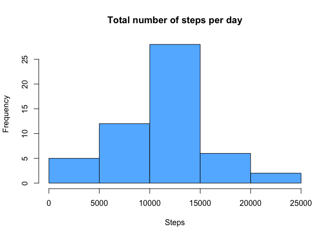
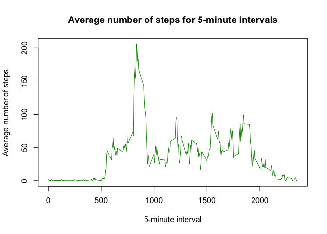
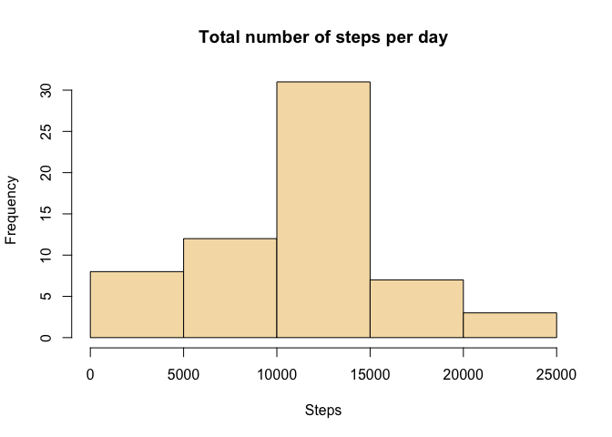
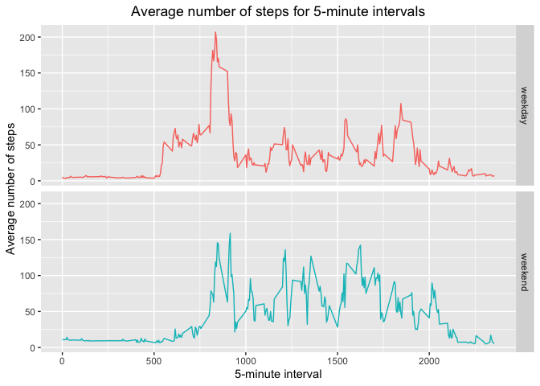

## Loading and preprocessing the data


```r
unzip('activity.zip')
activity <- read.csv('activity.csv')
activity$date <- as.Date(activity$date, '%Y-%m-%d')
```

## What is mean total number of steps taken per day?


```r
daily_steps <- aggregate(steps ~ date, data=activity, sum)
hist(daily_steps$steps, main='Total number of steps per day', xlab='Steps',
     col='steelblue1')
```

<!-- -->


```r
daily_steps.mean <- mean(daily_steps$steps)
daily_steps.median <- median(daily_steps$steps)
```

Mean of the total number of steps taken per day: 10766.19.  
Median of the total number of steps taken per day: 10765.

## What is the average daily activity pattern?


```r
avg_steps <- aggregate(steps ~ interval, data=activity, mean)
with(avg_steps, plot(steps ~ interval, type='l', col='green4',
                     xlab='5-minute interval', ylab='Average number of steps',
                     main='Average number of steps for 5-minute intervals'))
```

<!-- -->


```r
interval_with_max_avg_steps <- avg_steps[which.max(avg_steps$steps), 'interval']
```

5-minute interval with maximum number of steps averaged across all the days: 835.

## Imputing missing values


```r
NA_count <- sum(is.na(activity))
```
The total number of missing values: 2304.

The missing step values will be replaced with the mean of the 5-minute interval
averaged over all days.


```r
na_steps <- is.na(activity$steps)
new_activity <- activity
new_activity[na_steps,]$steps <- merge(activity[na_steps,], avg_steps,
                                       by='interval')$steps.y
```


```r
new_daily_steps <- aggregate(steps ~ date, data=new_activity, sum)
hist(new_daily_steps$steps, main='Total number of steps per day', xlab='Steps',
     col='wheat')
```

<!-- -->

```r
new_daily_steps.mean <- mean(new_daily_steps$steps)
new_daily_steps.median <- median(new_daily_steps$steps)
```

Mean of the total number of steps taken per day: 10766.19.  
Median of the total number of steps taken per day: 11015.

## Are there differences in activity patterns between weekdays and weekends?


```r
is.weekend <- weekdays(new_activity$date) %in% c('Saturday', 'Sunday')
new_activity$daytype <- factor(ifelse(is.weekend, 'weekend', 'weekday'))
```


```r
library(ggplot2)
avg_daytype_steps <- aggregate(steps ~ interval + daytype, data=new_activity, mean)
ggplot(avg_daytype_steps, aes(x=interval, y=steps, color=daytype)) +
        theme(legend.position='none', plot.title=element_text(hjust=0.5)) +
        xlab('5-minute interval') + ylab('Average number of steps') +
        ggtitle('Average number of steps for 5-minute intervals') +
        facet_grid(daytype~.) +
        geom_line()
```

<!-- -->
